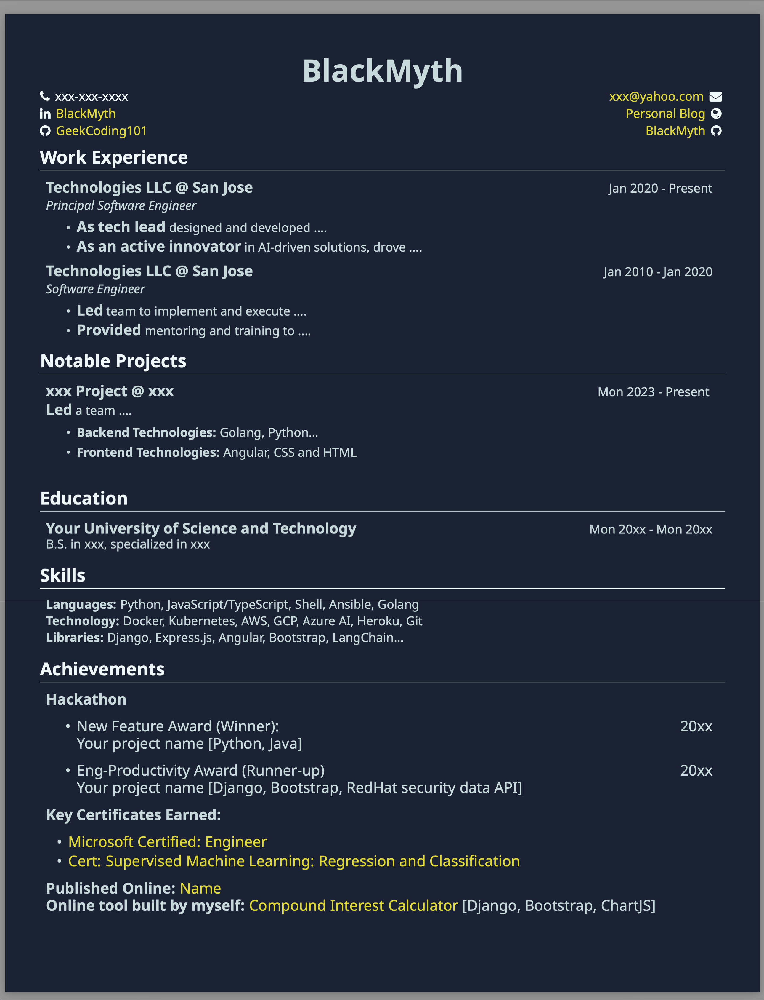

# Resume Template

This repository contains a resume template written in LaTeX, providing a professional format for job applications and academic use.

### Credits

This template is a customization based on the excellent work by [Zeyu-Li](https://github.com/Zeyu-Li/resume-template). Special thanks to their original design!

## Preview

Below is a preview of the resume template:



## Usage

To edit and compile this resume template, it’s recommended to use [Overleaf](https://www.overleaf.com/), a user-friendly, online LaTeX editor that simplifies LaTeX editing and sharing.

1. **Clone the repository**:
   ```bash
   git clone https://github.com/geekcoding101/resume.git
